# 🧘‍♀️ Health & Meditation UI

A calming and visually appealing mobile UI design built with Flutter for a health and mindfulness app. This project focuses purely on the user interface — no backend integration required.

## ✨ Features

- Clean and minimal onboarding, login, and registration screens
- Breathing animation for guided meditation
- Mood tracking and personalized suggestions
- Exercise and meditation categories with progress indicators
- Daily and weekly goal visualization
- Success animations and motivational messages
- Smooth transitions and Lottie animations
- Profile screen with mood history and settings

## 🧱 Tech Stack

- **Flutter** (Dart)
- **Provider** for state management
- **Lottie** for animations
- **Google Fonts**
- Custom reusable widgets and clean folder structure

## 📸 Screenshots

### 🔐 Login & Register
- Login Screen  
  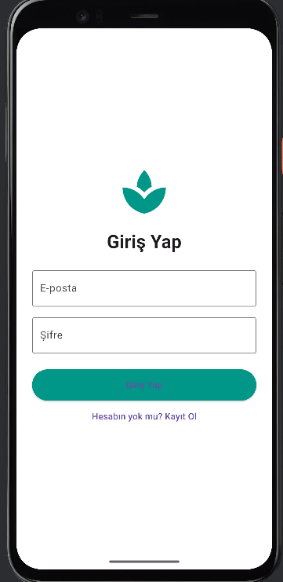
- Register Screen  
  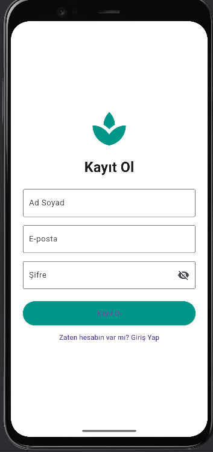

### 🏠 Home & Start
- Onboarding Start  
  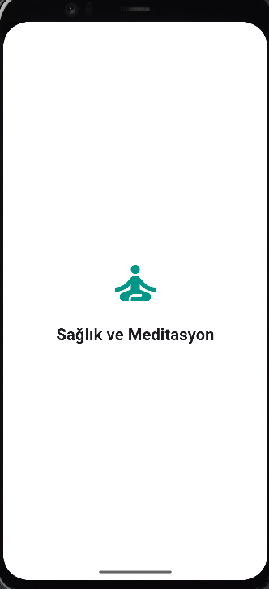
- Home Screen  
  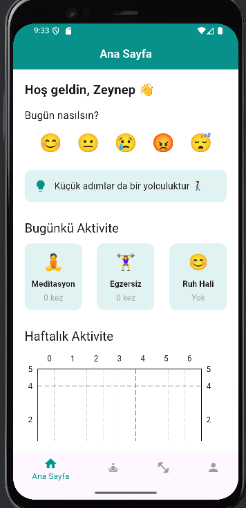

### 🧘 Meditation & Exercises
- Meditation  
  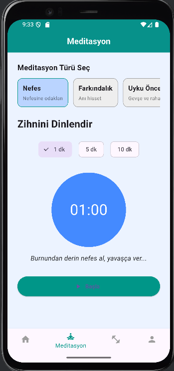
- Exercises  
  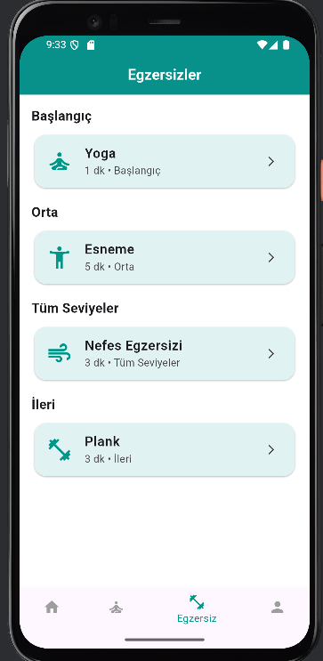
- Yoga  
  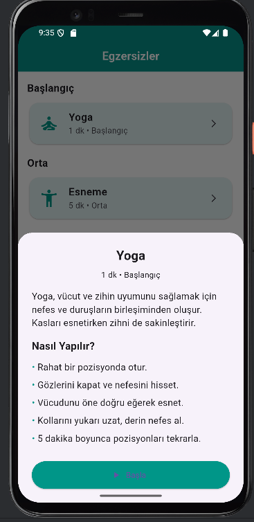

### 🎯 Goals & Statistics
- Goals  
  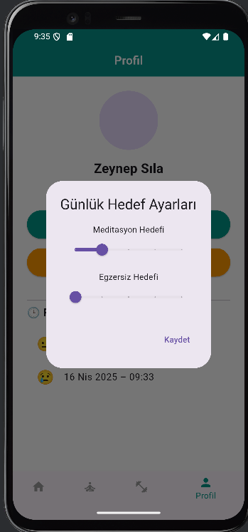
- Statistics  
  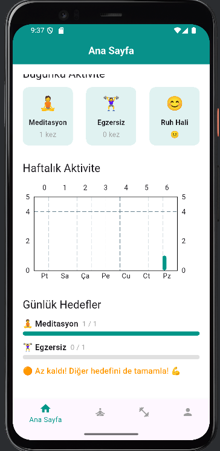

### 😴 Profile & Mood
- Profile  
  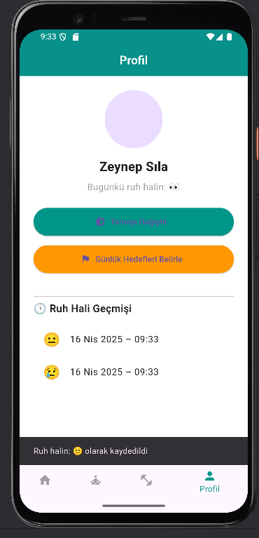
- Theme / Mood Tracker  
  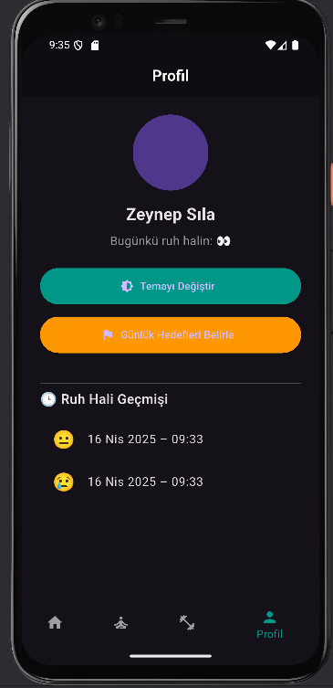
- Sleep Screen  
  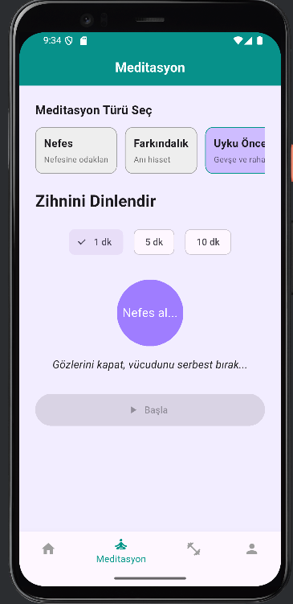

### 🏆 Completion Animation
- Success Animation  
  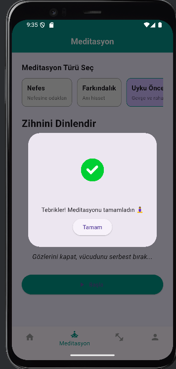

## 🚀 Getting Started

Clone the repository and run the project:

```bash
git clone https://github.com/your-username/HealthMeditationUI.git
cd HealthMeditationUI
flutter pub get
flutter run
